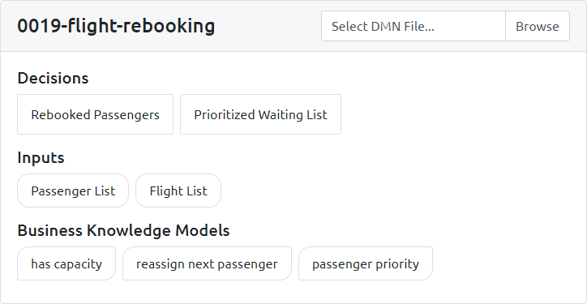
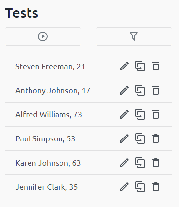

<p align="center">
  
  <br><br>
  
  
</p>

## Features
### Community
#### Overview
To provide an overview of the imported model, the included decisions, inputs and business knowledge models are displayed.



#### Powerful Builder
To simplify the creation of tests, the test framework supports the user by providing a powerful builder.
It supports complex data types and an increasing number of FEEL data types
(`feel:string`, `feel:date`, `feel:number` and `feel:boolean`).
The builder also suggests values that are predefined inside the imported model.


#### Batch Execution
The test framework is designed for the creation of hundreds of tests.
To test a modified model, all created tests can be executed simultaneously.



#### Structured Results
If an executed test fails, the test framework supports the user by providing
a clear overview of the differences between the expected and calculated output.


### Enterprise
#### Import and Export
The inputs, outputs and tests created using the test framework can be
easily imported and exported using the graphical user interface.

`TODO`

## Documentation
`TODO`

## Development
### Server
The following applications are required for server development:
- **Java 11**
- **Maven**
- **WildFly or JBoss** (support for other application servers will be added in the future)

#### Production
In order to build a web archive, the following commands should be executed:
```
cd ./server
mvn clean package
```
Afterwards, the generated web archive can be found at `./server/target/ROOT.war`.
If the test framework should be directly executed on an application server, the generated
web archive can be copied into the specified directory (for example `./standalone/deployments`).

If the test framework should be executed in a Docker Container,
the project can be built and executed by using the included Dockerfile.
```
docker build -t dmn-tester:1.0.0 .
docker run -p 127.0.0.1:8080:8080 dmn-tester:1.0.0 
```

### Client
The following applications are required for client development:
- **Node.js**
- **npm**

#### Initialization
In order to initialize the project environment, the following commands should be executed:
```
cd ./client
npm install
```
#### Development
In order to start the development server, the following command should be executed:
```
npm run dev
```
Afterwards, the web server can be accessed at `http://127.0.0.1`.

#### Production
In order to start the production build, the following command should be executed:
```
npm run build
```
Afterwards, the generated files can be found at `./server/src/main/webapp`.